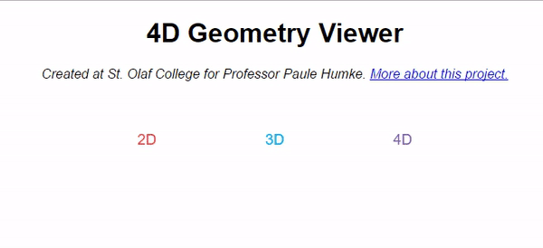

# Humke 4D Geometry Viewer
A project for Professor Paul Humke at St. Olaf College to teach 4D geometry by analogy (see [Flatland](https://en.wikipedia.org/wiki/Flatland)). Developed with the Mathbox library (https://gitgud.io/unconed/mathbox), this project seeks to meet the goals outlined [here](project-resources/SoftwareProject2017.pdf).

## Project Structure

**index.html** is the main entry point. The folder **/project-resources** contains the features & requirements and any other useful resources or documents. The folder **/src** contains all of our code & implementation and **/src/lib** contains any third party libraries we're using. 

