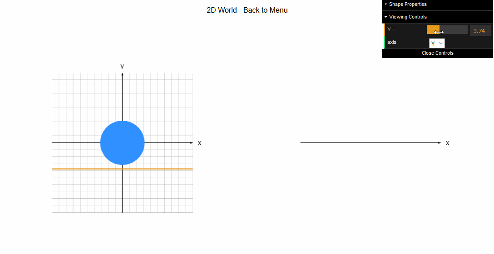
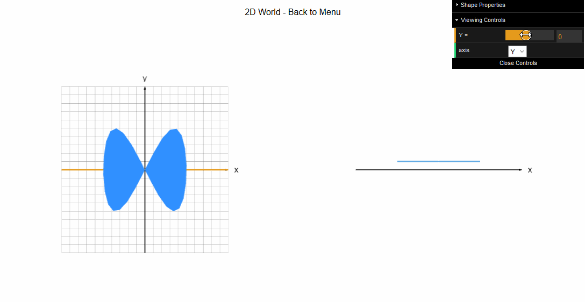
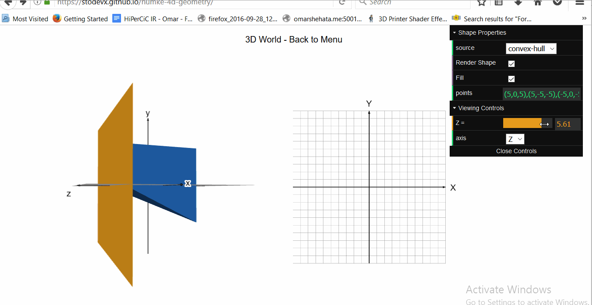
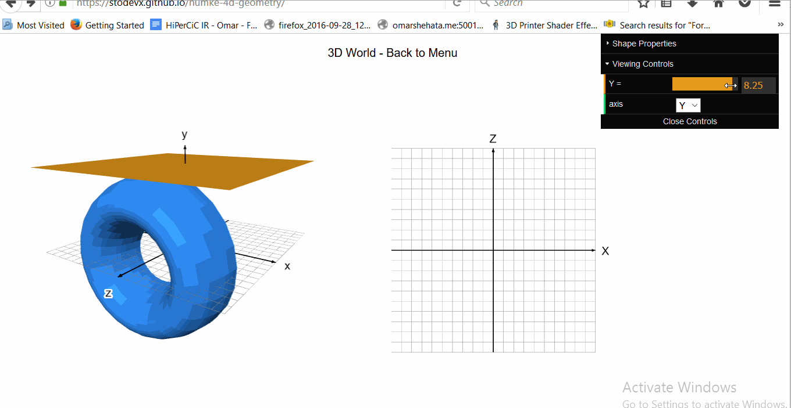
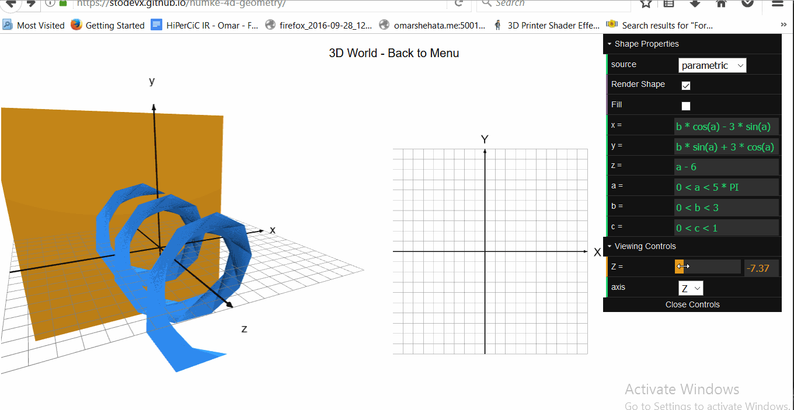
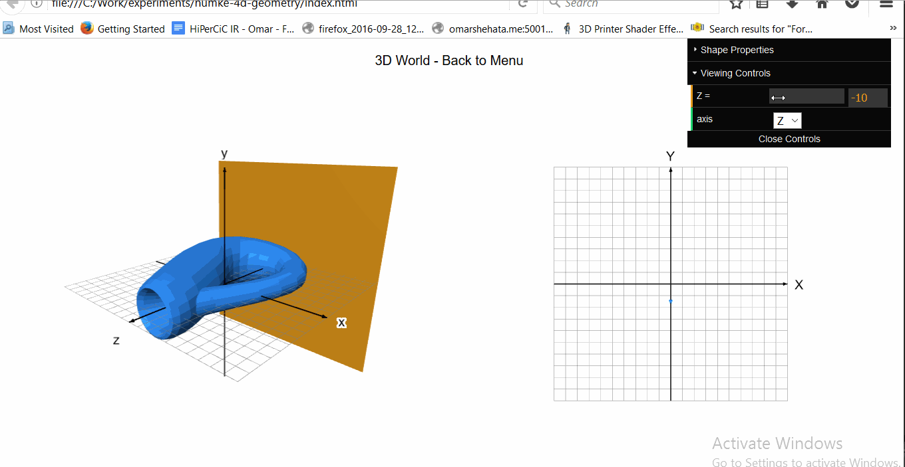
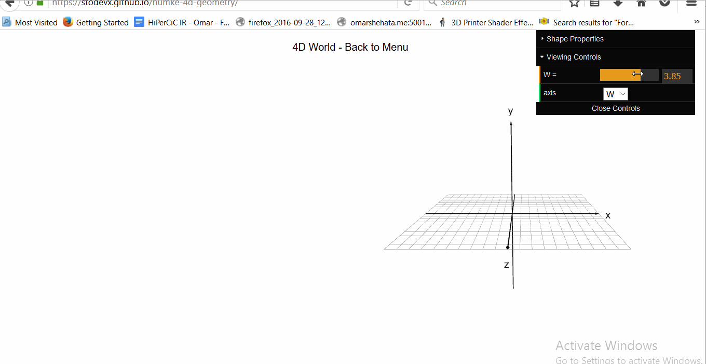

# Progress Report for April 13th 2017

The biggest milestone this week is in completing the work on intersections. We made 2D intersections significantly faster, we completed 3D intersections, and we have 4D intersections for cartesian equations working. 

The biggest problem we've run identified is figuring out how to fill in the 3D intersections, and 3D parametric equations. 

### 1 - Fast 2D Intersections 

Intersections in 2D have been implemented using a shader, which means they iterate over every pixel, and it does so extremely fast. It works for any arbitrary shape for any input in the same way.

Cartesian example:

Parametric example:

Convex hull example:

### 2 - 3D Cartesian Intersections 

We've completed our method of finding all the triangles, computing the intersection points on those triangles, and then drawing in the 2D shape bounded by those lines. 

We have the option of filling in or just drawing the bounds, because sometimes it's unclear where to fill in, for example:

But otherwise, it correctly and perfectly calculates the intersection bounds. 

### 3 - 3D Convex Hull Intersection 

This one works very well:

### 4 - 3D Parametric Intersection 

This one is a little tricky. The main problem is in trying to fill in the 3D shape. Using 3 parameters allows us to mathematically define the whole solid volume. But drawing that and computing the intersections on it is either not accurate enough (because not enough sampled points) or too computationally intensive. 

Instead, here, we only draw the bounds of the shape. So here is the half donut with just two layers:

So in 3D it looks like it's filled in as a solid. But because it's actually hollow we only get the outline of a shape in 2D. We think we can simply fill in the 2D intersection as opposed to trying to create a real solid 3D shape. 

Here are some more examples of parametric equations and their intersections: 

This one is fun because it's that idea that a twist in a higher dimension translates to a rotation in a lower dimension:

And just for a fun, a Klein bottle (not actually possible to define in the app with an equation, but this was hard coded in):

Summary: This is what we set out to do. The crossed out ones are the tasks that have been completed. 

### 5 - 4D Cartesian Intersections 

Finally, we have the first phase of intersections in 4D! Here is a 4D sphere being spliced:

This should theoratically work for any 4D equation but I haven't found any other good test cases other than a hypersphere. 

## Problems & Next Steps 

Our biggest hurdles seem to be filling in 3D intersections, and 4D intersections for parametric and convex hulls. 

### Filling in 3D intersections 

I think a fruitful approach is to make everything _seem_ like it's filled in. In 2D we can actually fill in our area, and our intersection just discards the extra pixels. So it's not a problem there. 

In 4D our intersections will be a set of planes/faces that are the bounds of the 3D shape. So we need not worry about filling in since we can't see the inside anyway.

So this is only a problem in 3D. So should we have students enter parametric equations as bounds instead of as in 3 parameters? And all we'd need to do is to figure out which parts are inside the shape, and fill in the intersection to make it feel solid. 

### 4D intersections 

Getting intersections of 4D cartesian equations was trivial because we just cancel out one variable and then draw a 3D equation. 

To do it for convex hulls, we'd need an algorithm that will take a set of 4D points, and return a set of simplices (pyramids?) that cover the boundary of the 4D shape. We can then calculate intersections of these pyramids with a cube (volume) which would return a set of planes which bound the 3D intersections. 

To do it for parametric equations...we need an algorithm to take 4D parametric equations and return a set of simplices. Once there, our method above should work. 

Is this a good direction? Do these algorithms exists? 

### Projections & Saving State

If there's time, I'd really like to implement 4D projections, as well as the ability to save and load states in the app because setting up equations, especially 3D parametric, is starting to get tedious, and I can imagine it being a hinderance for students/teaching. 

### More Testing

We also need to test the app more. Professor Humke, please try to use the latest version as if you were in class/teaching or as if you were a student, and note down all the problems you run into or things that are missing/need to be changed/improved. 
